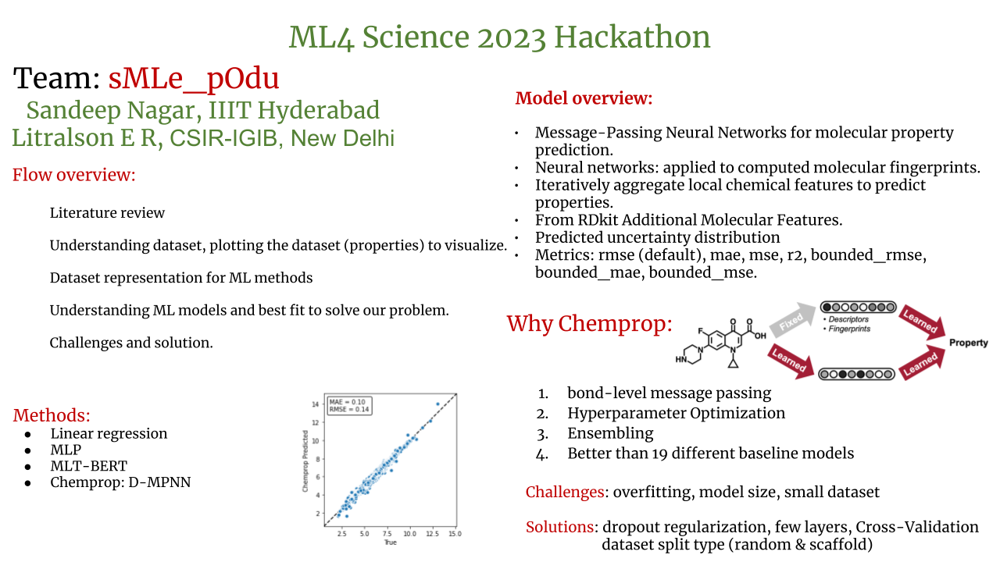

# Team-: sMLe_pOdu 
(ML-machine learning, s-science, smle-fourletter (ML4Science), O-organic, smile-imput dataset, podu- a word from Tamil language)

Notion: [notebook](https://naagar.notion.site/ML4Science-03db8047b2424bbdb53bbdfc4b2ff0e3)

## Presenation: 

## About dataset: 

Train: dataset_train.csv (5000 smiles with four different mol properties)

Test: dataset_test.csv (1000 smiles only)

        Splitting data with seed 0
        5000it 
        Total size = 5,000 | train size = 4,000 | val size = 500 | test size = 500

## Models

### Training the model:

`
      arguments = [
          '--data_path', 'dataset_train.csv',
          '--dataset_type', 'regression',
          '--save_dir', 'test_checkpoints_reg',
          '--epochs', '10',
          '--hidden_size_solvent', '100',
          '--dropout', '0.5',
          '--depth', '2',
          '--hidden_size', '100',
          '--hidden_size_solvent', '100',
          '--save_smiles_splits'
      ]
`
Total Number of params: 

## final code:

## Results

rms plot for the 4th molecular property after trainig model for 30 epochs 

rms plot for the 4th molecular property after trainig model for 100 epochs

### GT and Pred values

## to-do:

### refrences 

Yang, Kevin, Kyle Swanson, Wengong Jin, Connor Coley, Philipp Eiden, Hua Gao, Angel Guzman-Perez et al. "Analyzing learned molecular representations for property prediction." Journal of chemical information and modeling 59, no. 8 (2019): 3370-3388.

[A Survey of Artificial Intelligence in Drug Discovery](https://github.com/dengjianyuan/Survey_AI_Drug_Discovery)

[Chemprop: Message Passing Neural Networks for Molecule Property Prediction](https://github.com/chemprop/chemprop)

[Graph neural network (GNN) for molecular property prediction (SMILES format)](https://github.com/masashitsubaki/molecularGNN_smiles) 
